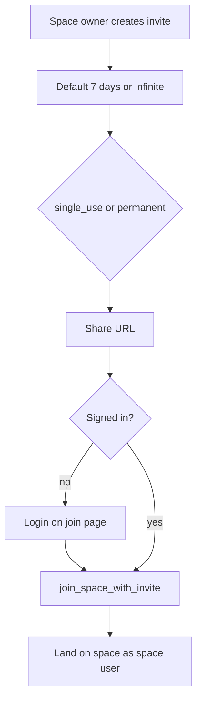
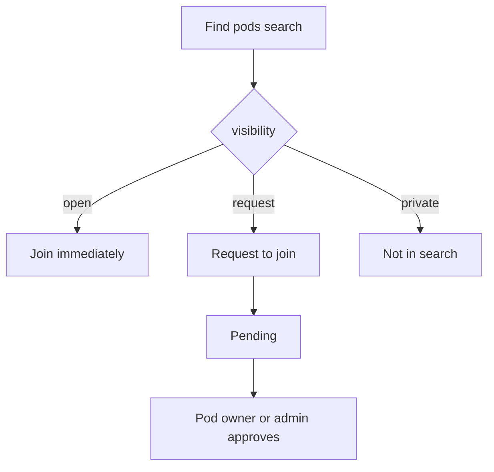

# App shell, PWA, and spaces

Yes — **installable on a phone means a PWA** (Web App Manifest + HTTPS +, for Chrome/Android install, a service worker). iOS uses “Add to Home Screen” and needs Apple web-app meta plus icons; it does not require a store listing.

Scope is [`simpleOutcomeDev`](packages/web): marketing site stays a normal website; **only `/app` is the installable product** (`start_url` / `scope` = `/app`).

**Decisions**

- Login only on `/app`. **Delete `/login` and `/signup`**. Public signup stays off; accounts are created in the dashboard.
- Unique **username** (handle) per user.
- **No personal vs shared kind.** New Auth user gets one space named **My space** (space owner). They can create more spaces.
- Space invites: **single-use or permanent**, listed, disable/delete. Optional **`expires_at`**: default **7 days**, or **infinite** (`null`).
- Two role layers: **space** and **pod**.
- **Feature** = catalog kind. **Pod** = instance in a space.
- Pod visibility is Slack-like **three-way:** `open` | `request` | `private` (not a public/private pair).
- Status `active` | `archived`. Default lists: **active pods the user can access**. **Space owner** has a switch to also show **archived** (all active + archived they can access, which is every pod in the space). **Only the space owner can delete.** Stubs only this slice.

---

## 1. Theme-first UI ([`packages/web/styles/so-theme.ts`](packages/web/styles/so-theme.ts))

Today the file only has brand tokens, semantic colors (`bg.canvas`, `bg.paper`, `fg.*`), fonts, and `globalCss`. Components still hardcode layout (e.g. [`AppHeader.tsx`](packages/web/components/app/AppHeader.tsx)).

**Put reusable look in the system:**

- Semantic tokens: `border.subtle`, `bg.header`, `shadow.card` (latte/brown, light/dark).
- Chakra v3 **recipes / slot recipes** for app chrome: `appHeader`, `appShell`, `authCard`, `spaceCard`.
- Default **Button** recipe: `colorPalette: brand` where that is already the app default.
- Keep one-off marketing art (hero in [`HeroSection.tsx`](packages/web/components/marketing/HeroSection.tsx)) in the component.

Do not invent a second design system file.

---

## 2. PWA for https://simpleoutcome.dev/app

No extra npm package: Next.js [`app/manifest.ts`](packages/web/app/manifest.ts) + a small static service worker.

- **Manifest:** SimpleOutcome, `display: standalone`, `start_url: /app`, `scope: /app`, brand `theme_color` / `background_color`, icons **192** and **512** PNG under [`packages/web/public/`](packages/web/public/).
- **Root metadata** in [`app/layout.tsx`](packages/web/app/layout.tsx): `appleWebApp`, `manifest`, existing `viewport.themeColor`.
- **Service worker:** `public/sw.js` + register only from the private app layout.
- Marketing **Sign in** → **`/app`**.

---

## 3. In-app login; delete `/login` and `/signup`

Move the form from [`LoginPageForm.tsx`](packages/web/app/login/LoginPageForm.tsx) to `components/app/AppLoginForm.tsx` (`authCard` recipe).

[`PrivateRouteGuard`](packages/web/components/app/PrivateRouteGuard.tsx): loading → login form → children. Show [`AppHeader`](packages/web/components/app/AppHeader.tsx) only when signed in.

**Delete** (not redirect): [`app/login/`](packages/web/app/login/), [`app/signup/`](packages/web/app/signup/), [`signupEnabled.ts`](packages/web/lib/auth/signupEnabled.ts), [`resolveSafeReturnUrl.ts`](packages/web/lib/auth/resolveSafeReturnUrl.ts) if unused, [`AppPageSignInRequiredState.tsx`](packages/web/components/app/AppPageSignInRequiredState.tsx) if replaced.

Update [`robots.ts`](packages/web/app/robots.ts) (`disallow` `/api/` and `/app`). Join URLs stay under `/app`.

Join page uses the same guard: unsigned users see **login**, then join.

---

## 4. Username, spaces, invites, features, and pods

### Vocabulary

| Term | Meaning |
|------|---------|
| **Feature** | Catalog kind in `@so/model` (`todo_list`, `shopping_list`, …). Not a row per space. |
| **Pod** | One instance of a feature in a space (members, visibility, active/archived). |
| **Space** | Group of users. |

UI: “Add a feature” creates a **pod**. **Find pods** is the Slack channel browser. Roles: space owner / space admin / space user; **pod owner / pod admin / pod user**.

### Username (handle)

- `profile.username` — unique, case-insensitive (canonical lowercase).
- Set on first login (prompt if empty) or settings. Handle when adding people already in the space.

### Space roles

| Role | Can |
|------|-----|
| **Space owner** | Access **all** pods (including `private`, without membership). Assign **space admin**. Manage invites. Create spaces. Update / archive any pod. **Delete** a pod (**only this role**). Toggle **Show archived** on the pod list. |
| **Space admin** | **Add** (create) pods only — not update, archive, or delete. Use a pod only with a pod role, or by joining `open` / approved `request`. |
| **Space user** | Home list: **active** pods they can access. Find pods: `open` and `request` only. |

Invite join always adds **space user**. Default space name: **My space**. Trigger on `auth.users` insert. Any authenticated user can create more spaces (they become space owner).

### Invites (space only)

- URL: `/app/join/[token]`. Store **hash** of the token; raw token shown once to copy.
- **Mode:** `single_use` or `permanent`.
- **`expires_at`:** optional timestamptz. **Default 7 days** from create. **Infinite** = `null` (never expires). Join fails if disabled, consumed (single-use), or past `expires_at`.
- Space owner **lists** invites (mode, expiry, status). **Disable** or **delete**.
- Signed-in join → `join_space_with_invite`; already a member → open space. Unsigned → login on the same URL, then join.

### Pod lists and archive

- **Default (everyone):** only **active** pods the user **already can access** (home / sidebar, Slack “your channels”).
- **Space owner switch** (off by default): show **all active and archived** pods in the space (owner already has access to all). Used to restore archive.
- Direct URL to an archived pod: not found unless space owner (or that pod owner, if we still allow them to open their archived pod from the owner switch / a deep link). **Pod owner** can archive; they need a way to un-archive — include **their** archived pods when they use a personal “show archived” or only the space-owner switch. **Plan:** space owner switch is the full archive browser; **pod owner** also sees **their** archived pods when that switch is on *or* via a “Show archived” on pods they own. Simplest: **space owner** has the global switch; **pod owner** sees their archived pods in the same switch if they are also space owner, otherwise a **Show archived** control that lists only pods they own. Prefer one control: **Show archived** visible to space owner (all) and to pod owners (owned pods only).

### Pod visibility (Slack-like)

Creating a pod makes the creator **pod owner**. `visibility`: `open` | `request` | `private`. `status`: `active` | `archived`. Optional display `name`. Multiple pods of the same feature allowed.

| Visibility | Slack analogue | Find pods / search | Join |
|------------|----------------|--------------------|------|
| **open** | Public channel | Listed (active only) | Instant — becomes **pod user** |
| **request** | Restricted / ask to join | Listed (active only) | **Request** then **approve** (pod owner or pod admin; space owner may approve). Then **pod user**. |
| **private** | Private channel | **Not** listed or searchable | Pod owner **adds** existing space members by username. No self-join. |

**Find pods:** in-space search/browse (Slack channel browser). Query name/feature. Results: active `open` and `request` only. Never `private`. Never archived.

Space owner already has access to every pod; they need not join. Space admin does **not** see `private` in Find pods unless they are a member.

| Role | Can |
|------|-----|
| **Pod owner** | Update their pod. Archive / un-archive. Assign pod roles to space members. Approve/deny join requests. **Cannot delete.** |
| **Pod admin** | Assign/remove pod users and other pod admins (not the owner). Approve/deny join requests. **Cannot** update, archive, or delete. |
| **Pod user** | Use the pod when the feature is built. |

### Tables

- `profile` — unique `username`
- `space` — `id`, `name`, `created_at`
- `space_member` — role `space_owner` \| `space_admin` \| `space_user`
- `space_invite` — `token_hash`, `mode` (`single_use` \| `permanent`), `expires_at` (null = infinite), `disabled_at`, `consumed_at`, `created_by`
- `pod` — `space_id`, `feature`, optional `name`, `visibility` (`open` \| `request` \| `private`), `status` (`active` \| `archived`), `created_by`
- `pod_member` — `pod_id`, `user_id`, `role` (`pod_owner` \| `pod_admin` \| `pod_user`)
- `pod_join_request` — `pod_id`, `user_id`, `status` (`pending` \| `approved` \| `denied`), unique pending pair, requester must be `space_member`

Constraints: last space owner protected; pod owner row for creator; `pod_member` / join requests only for space members.

**RLS:** private-schema `security definer` helpers. Never authorize from `user_metadata`.

**App I/O:** spaces, invites (including expiry), `listDbPods`, `searchDbPods`, `joinDbOpenPod`, `createDbPodJoinRequest`, `listDbPodJoinRequests`, `approveDbPodJoinRequest`, `denyDbPodJoinRequest`, pod CRUD/archive, delete (space owner only), pod members, username helpers. Valibot + tests in [`packages/model`](packages/model).

**UI:** space list; username; invite manager (7-day default, infinite option); home pod list; **Show archived**; **Find pods**; open join; request + approval inbox; private add-by-username; stubs for todo/shopping.

---

## 5. Out of scope (this plan)

- Implementing todo / shopping data and screens (stubs only)
- Public signup / email-based invites
- Billing, realtime, storage
- Marketing rebrand

---

## Verification

- `/login` and `/signup` 404; unsigned `/app` shows login.
- PWA install on `/app`.
- Invite: default expiry ~7 days; infinite never expires; expired token fails; single-use second join fails; list/disable/delete.
- Find pods: `open` join works; `request` stays pending until approve; `private` absent from search; add-by-username still works for private.
- Default home: active + access only. Space owner switch shows archived too.
- Pod owner cannot delete; space owner can.
- Apply migration to the linked Supabase project before production deploy.
