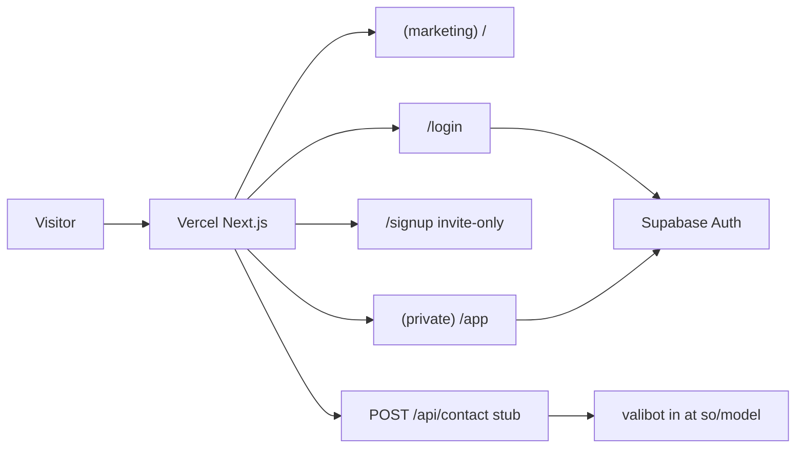

# SimpleOutcome first-step stack migration

This step is **infrastructure + shells only**. Keep the current CraftySmile / GoalJar / CoachPebble marketing page. Contract-work rebrand, todo/shopping/finance app, and real Supabase tables are later steps.

**Decisions already made**

- Monorepo now: `packages/web` + `packages/model` (no `@so/component`, chrome, or e2e yet)
- Auth: `/login` works; `/signup` exists and is **invite-only** (UI disabled, `signUp` code kept behind a flag)
- Contact: drop CraftySmile `NEXT_PUBLIC_BACKEND`; add `POST /api/contact` stub
- Domain stays **simpleoutcome.dev** on Vercel (you will point DNS)

Reference repo: [trading-journal/packages/web](file:///home/coolcold/repo/trading-journal/packages/web) and [trading-journal/.github/workflows/production.yml](file:///home/coolcold/repo/trading-journal/.github/workflows/production.yml).

---

## Target architecture



```
simpleOutcomeDev/
  package.json          # workspaces + lerna scripts
  lerna.json
  supabase/config.toml  # local CLI ready; no migrations yet
  .github/workflows/production.yml
  packages/
    model/              # @so/model — valibot schemas
    web/                # @so/web — Next.js App Router
```

Package names: **`@so/web`** and **`@so/model`** (same short-prefix pattern as `@tj/*`). Current `@cc/webSimpleOutcome` goes away.

---

## Stack to match trading-journal

| Layer            | From (simpleOutcomeDev) | To                                                                |
| ---------------- | ----------------------- | ----------------------------------------------------------------- |
| Node             | 20 (GHA)                | **24**                                                            |
| Next.js          | 15.3.4                  | **^16.3.1** (`next dev/build --webpack`)                          |
| React            | 19.1.0                  | **^19.2.8**                                                       |
| UI               | MUI 6 + Emotion styled  | **Chakra UI ^3.36.1** + `@emotion/cache` SSR                      |
| Auth / DB client | none                    | **`@supabase/supabase-js` ^2.112.3**                              |
| Validation       | unused zod              | **valibot** in `@so/model`                                        |
| Animation        | framer-motion 12        | **^13.1.0**                                                       |
| TypeScript       | 5                       | **^6**                                                            |
| Tooling          | `@coolcolduk/*` ^3      | **prettier-config 6**, eslint/jest/ts-config **^6**, util **^11** |
| Hosting          | GitHub Pages (disabled) | **Vercel prebuilt from GHA, production only**                     |

Do **not** pull Stripe, chrome extension, `@tj/component`, or Lerna staging workflows.

Drop: `@mui/*`, `@emotion/styled`, `zod`, unused `uuid`, Firebase `deploy` script, GitHub Pages workflow, committed CraftySmile `.env.*`, [CNAME](file:///home/coolcold/repo/simpleOutcomeDev/CNAME) (Vercel owns the domain).

---

## 1. Monorepo move

- Root [package.json](file:///home/coolcold/repo/simpleOutcomeDev/package.json): `workspaces: ["packages/*"]`, `lerna@10`, scripts `dev:web`, `build:model`, `build:web`, `build`, `lint` — same shape as [trading-journal/package.json](file:///home/coolcold/repo/trading-journal/package.json) minus chrome/component/e2e/supabase-deploy extras.
- Move `src/app`, `src/components`, `src/theme`, `public`, `next.config.mjs` → `packages/web/` with TJ-style **no `src/`** layout (`app/`, `components/`, `lib/`, `styles/`). Path alias `@/*` → `packages/web/*`.
- `packages/web/next.config.mjs`: `outputFileTracingRoot` = monorepo root; `optimizePackageImports: ['@chakra-ui/react']`.
- `packages/web/vercel.json`: `{ "outputDirectory": ".next" }`.
- `packages/model`: tsdown build, named exports only, `index.ts` public API, Jest for exported helpers (project rule). First exports: contact request schema + a `SIGNUP_ENABLED`-style constant is **web-only** (not model).

---

## 2. Chakra UI (keep latte/brown, not EndureTrade slate/orange)

Port [src/theme/theme.ts](file:///home/coolcold/repo/simpleOutcomeDev/src/theme/theme.ts) to Chakra v3 `createSystem` / `defineConfig` like [packages/web/styles/tj-theme.ts](file:///home/coolcold/repo/trading-journal/packages/web/styles/tj-theme.ts):

- Tokens: primary `#D7A86E`, dark `#6B4F3A`, canvas `#F6E7D8` / paper `#FCF9F4`
- `EmotionCacheProvider` + `ChakraProvider` in `app/provider.tsx` (copy TJ SSR cache pattern)
- Convert every MUI surface: `HeroSection`, `ProjectsSection`, `Footer`, `ContactUsDialog`, home `page.tsx`
- **Delete unused** [Header.tsx](file:///home/coolcold/repo/simpleOutcomeDev/src/components/Header.tsx); add a slim marketing nav (Home + Sign in) in `(marketing)/layout.tsx`
- Keep framer-motion on the projects section

---

## 3. App Router layout (marketing vs private)

```
packages/web/app/
  layout.tsx, provider.tsx, globals.css, robots.ts, sitemap.ts
  (marketing)/layout.tsx, page.tsx          # current home
  login/                                    # working email+password
  signup/                                   # invite-only shell
  (private)/layout.tsx                      # PrivateRouteGuard, noindex
  (private)/app/page.tsx                    # empty "coming soon" dashboard
  api/contact/route.ts                      # stub
```

- Centralize site name / SEO / `NEXT_PUBLIC_WEB_URL` in `lib/env.ts` + `lib/seo/default-metadata.ts` (TJ pattern). Canonical: `https://simpleoutcome.dev`.
- `robots.ts`: allow `/`; disallow `/app`, `/api/`.
- `sitemap.ts`: only URLs that exist (`/`). Remove the current phantom `/projects` and `/contact`.

**Auth (browser client, no `@supabase/ssr`, no middleware)** — copy TJ:

- `lib/supabase/getSupabaseBrowserClient.ts`
- `lib/supabase/useSupabaseAuthState.ts`
- `PrivateRouteGuard` (simplified from [RouteGuards.tsx](file:///home/coolcold/repo/trading-journal/packages/web/components/app/RouteGuards.tsx))
- Login: `signInWithPassword` → redirect `/app`
- Signup page: full form + `supabase.auth.signUp` **behind `SIGNUP_ENABLED = false`**; when false, show “Invites only” and a link to `/login`
- Create your user in the Supabase dashboard (this step does not open public registration)

Optional later (out of scope): forgot-password, `/api/auth/*` Bearer routes.

---

## 4. Contact API stub

- `@so/model`: valibot schema `{ name, email, message }` + unit tests
- `app/api/contact/route.ts`: parse body; on success return **200 `{ ok: true }` without persistence** (log only) so the marketing dialog still completes; persistence is a later Supabase table
- Dialog `fetch('/api/contact')` — no `NEXT_PUBLIC_BACKEND`

Naming: handler can stay a Route Handler; any extracted I/O helper uses `{action}{Service}{Resource}` (e.g. later `createDbContactMessage`).

---

## 5. Production GHA (no staging)

Replace [.github/workflows/nextjs.yml](file:///home/coolcold/repo/simpleOutcomeDev/.github/workflows/nextjs.yml) with a **production-only** workflow modeled on TJ, stripped of chrome, `@tj/component`, and `supabase db push`:

- `workflow_dispatch` with `description`, `release_type` (minor/major), `deploy_vercel`
- Node 24, `GH_PAT` for `@coolcolduk` GitHub Packages (existing `.npmrc`)
- Lint, Lerna version bump + tag, `npm run build:model`, then:

```bash
npx vercel pull --yes --environment=production --token="$VERCEL_TOKEN"
npx vercel build --prod --yes --token="$VERCEL_TOKEN"
npx vercel deploy --prebuilt --prod --yes --token="$VERCEL_TOKEN"
```

- Inject `NEXT_PUBLIC_APP_VERSION` / `NEXT_PUBLIC_GIT_COMMIT`
- Push tag + GitHub Release (same as TJ)
- **Do not** add Supabase migration deploy until there are migrations

**You configure (not in code):**

- Vercel project: Framework Next.js, **Root Directory `packages/web`**, **Include files outside root** on, **disable Git auto-deploy**
- GitHub vars: `VERCEL_ORG_ID`, `VERCEL_PROJECT_ID_PRODUCTION`
- GitHub secret: `VERCEL_TOKEN` (plus existing `GH_PAT`)
- Vercel env: `NEXT_PUBLIC_SUPABASE_URL`, `NEXT_PUBLIC_SUPABASE_ANON_KEY`, `NEXT_PUBLIC_WEB_URL=https://simpleoutcome.dev`
- DNS: add `simpleoutcome.dev` in Vercel; move records off GitHub Pages
- Supabase project: Email auth on; create your user in the dashboard

Add `packages/web/env.example` and a short `AGENTS.md` (stack facts only) so later steps have the same constraints as trading-journal.

Scaffold `supabase/config.toml` for future `npx supabase start`; no tables this step.

---

## 6. Explicitly out of scope (later steps)

- Contract-work marketing rebrand
- Todo / shopping / finance features
- Supabase Postgres tables, RLS, service-role usage, Realtime
- Staging environment
- Shared `packages/component`
- Forgot-password / OAuth / API Bearer auth for a second client

---

## Verification

- `npm run build` (model then web) after install
- Browser: home (Chakra, contact dialog → `/api/contact`), `/signup` invite-only, `/login` (needs real Supabase env), `/app` redirects when signed out
- Confirm GitHub Pages workflow is gone so a push cannot publish `out/`

Manual DNS/Vercel/Supabase project creation is on you; the code change is complete when GHA can deploy given those secrets.
