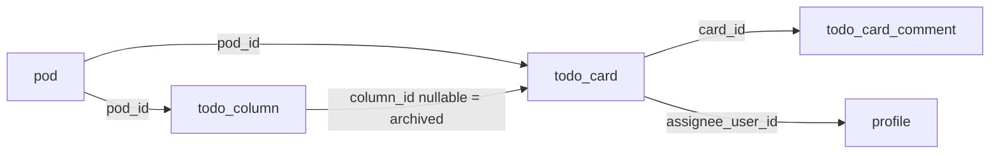

# Todo list Kanban (first feature)

## Context

[`FEATURE_KINDS`](packages/model/src/space/featureKind.ts) already includes `todo_list`. [`PodWorkspace`](packages/web/components/app/PodWorkspace.tsx) still shows “coming soon”. [`public.pod`](supabase/migrations/20260828120000_spaces_pods_invites.sql) has optional `name` but **no description**. There is **no Storage bucket** and **no feature tables**. Membership writes stay on RPCs; board CRUD uses **table RLS** (no Realtime / `subscribe`).

**Out of scope:** shopping list UI, Realtime, E2E, image zoom package.

## Status vs column id (decision)

**Store only `column_id`. Do not store a status title or an `active`/`archived` enum.**

Displayed status:

- `column_id` set → that column’s `title` (rename updates every card).
- `column_id` null → **Archive**.

Dragging updates `column_id` and `sort_order`. No denormalized status string.

## Archive (decision)

Archive **is** `todo_card.column_id IS NULL`. No `status` / `archived_at` columns.

- **UI:** a right-hand **side panel** that behaves like one extra column labelled Archive. It is not a `todo_column` row (so it cannot be renamed, reordered, or deleted as a board column).
- **Drag:** members can drag a card from a real column into Archive (`column_id = null`) and from Archive onto any real column (`column_id` set). Same `moveDbTodoCard` path as board-to-board moves.
- **Delete column:** `column_id` FK **ON DELETE SET NULL**. Cards in that column become archived automatically. Deleting a column is allowed even when it has cards (admin+).
- **Archive all in column:** member action on a column (menu/button) that sets `column_id = null` for every card in that column (keep `sort_order` or reindex in the archive list). Column itself stays.
- Card dialog can still have an **Archive** action (sets `column_id` null); restore is **drag to a column**, not a separate restore-to-last-column feature (last column is gone once `column_id` is cleared).

Query archived cards: `.eq('pod_id', podId)` + `.is('column_id', null)`.

## Permissions

Space owner is treated like pod admin for this feature (same as existing `can_approve_pod_join`).

| Action                                                                             | Who                                                  |
| ---------------------------------------------------------------------------------- | ---------------------------------------------------- |
| Create / rename / reorder / delete **columns**                                     | `pod_owner`, `pod_admin`, or space owner             |
| Create / edit / move / archive (incl. archive-all) / assign / comment on **cards** | Any `pod_member` or space owner                      |
| Edit pod title / description / visibility                                          | Existing `can_manage_pod` (pod owner or space owner) |

`pod_user` cannot add or drag columns. Column DnD is disabled for them. They **can** drag cards, including into/out of the Archive panel.

Board **read**: pod member or space owner only (open-pod browsers who have not joined cannot see cards).

## Product rules

- Each **pod** is one board. Rows and Storage objects keyed by `pod_id`. Pod delete cascades feature rows.
- Empty board on create; admins add columns. New cards are created in a real column (not in Archive), unless the user later archives them.
- No Realtime.

## Data model

Enable **`moddatetime`** (same as trading-journal): `create extension if not exists moddatetime with schema extensions;` then `BEFORE UPDATE ... execute function extensions.moddatetime('updated_at')` on new tables (and optionally `pod` when we start updating description from SQL/RPC). simpleOutcome already uses `pgcrypto` in `extensions`; it does **not** yet use `moddatetime` (RPCs set `updated_at = now()` by hand).

Tables (snake_case, RLS on):

- **`todo_column`**: `id` uuid PK `default gen_random_uuid()`, `pod_id` FK cascade, `title`, `sort_order`, `created_at`, `updated_at`.
- **`todo_card`**: `id` uuid PK `default gen_random_uuid()`, `pod_id`, `column_id` **nullable** FK **ON DELETE SET NULL**, `title`, `description` default `''`, `due_at` `date` nullable, `tags` `text[]` default `{}`, `assignee_user_id` nullable FK `profile(id)` ON DELETE SET NULL, `sort_order`, `created_by`, `created_at`, `updated_at`. Card `pod_id` must match column `pod_id` when `column_id` is set (trigger). Assignee, if set, must be a `pod_member` of that pod (trigger).
- **`todo_card_comment`**: `id` uuid PK `default gen_random_uuid()`, `pod_id`, `card_id` FK cascade, `body` text, `created_by`, `created_at`, `updated_at`. Members can insert; author can update/delete own; pod admin / owner / space owner can delete any.

**IDs:** same as existing space/pod tables — `gen_random_uuid()`. That function is already available (`pgcrypto` is created in [`20260828120000_spaces_pods_invites.sql`](supabase/migrations/20260828120000_spaces_pods_invites.sql)). **Do not enable `uuid-ossp`.** That extension is for `uuid_generate_v4()` / v1; trading-journal enables it in a squash baseline, but this repo does not use those functions and does not need another extension.

**Pod description:** `pod.description text` nullable; extend `create_pod` / `update_pod` like [`space.description`](supabase/migrations/20260829010000_space_description.sql). Create dialog: title + description. Workspace: managers edit title/description.

**Storage:** private bucket `pod-private` (JPEG/PNG, 5MB). Path `{pod_id}/{card_id}/img-{unix}.{jpg|png}`. Markdown ``; signed URLs at render. Storage RLS: first path segment = `pod_id` and (pod member or space owner). Cap inline images per card in `@so/model` (e.g. 10).

Postgres `pod.feature` stays **text + CHECK** (`todo_list` \| `shopping_list`) so we do not migrate to a PG enum. The **catalog lives in TypeScript `enum FeatureKind`**.

## TypeScript enums for catalogs

Same pattern as [`PodRole`](packages/model/src/space/podRole.ts) / [`SpaceRole`](packages/model/src/space/spaceRole.ts). **Drop the `as const` arrays.** Parse with `v.enum(TheEnum)` where a schema exists; iterate in UI with `Object.values(TheEnum)`. Postgres stays **text + CHECK** (no PG enums).

| File                                                                    | Change                                                                                                                                                                                                                                                                                                                  |
| ----------------------------------------------------------------------- | ----------------------------------------------------------------------------------------------------------------------------------------------------------------------------------------------------------------------------------------------------------------------------------------------------------------------- |
| [`featureKind.ts`](packages/model/src/space/featureKind.ts)             | `enum FeatureKind { TODO_LIST = 'todo_list', SHOPPING_LIST = 'shopping_list' }`. Drop `FEATURE_KINDS`. Default `FeatureKind.TODO_LIST`.                                                                                                                                                                                 |
| [`podStatus.ts`](packages/model/src/space/podStatus.ts)                 | `enum PodStatus { ACTIVE = 'active', ARCHIVED = 'archived' }`. Drop `POD_STATUSES`.                                                                                                                                                                                                                                     |
| [`podVisibility.ts`](packages/model/src/space/podVisibility.ts)         | `enum PodVisibility { OPEN = 'open', REQUEST = 'request', PRIVATE = 'private' }`. Drop `POD_VISIBILITIES`.                                                                                                                                                                                                              |
| [`spaceInviteStatus.ts`](packages/model/src/space/spaceInviteStatus.ts) | `enum SpaceInviteStatus { ACTIVE, EXPIRED, EXHAUSTED, DISABLED }` with those string values. Drop `SPACE_INVITE_STATUSES`.                                                                                                                                                                                               |
| Invite filter                                                           | `enum SpaceInviteStatusFilter { ALL = 'all', ACTIVE = 'active', EXPIRED = 'expired', EXHAUSTED = 'exhausted', DISABLED = 'disabled' }` (includes `all` because the invitations page and `list_space_invites` RPC use it). Drop `SPACE_INVITE_STATUS_FILTERS`. Filter buttons: `Object.values(SpaceInviteStatusFilter)`. |
| [`spaceInviteMode.ts`](packages/model/src/space/spaceInviteMode.ts)     | **Delete.** `single_use` / `permanent` are unused. Invites already use **max uses + expiry** ([`SpaceCreateInviteDialog`](packages/web/components/app/SpaceCreateInviteDialog.tsx)). Only re-exported from [`index.ts`](packages/model/src/space/index.ts); nothing imports the type.                                   |

Call sites to update: `parseFeatureKind`, `featureKindLabel`, `spaceInviteStatusLabel`, `deriveSpaceInviteStatus` (return `SpaceInviteStatus.ACTIVE` etc.), `filterAccessiblePods`, `SpaceCreatePodDialog`, `SpaceInvitationsPage`, `listDbSpaceInvites` / pod list helpers (cast to enum), package `index.ts` exports.

`@so/model` todo helpers still as below.

## Access (SQL)

Helpers (security definer, reuse existing role functions):

- `can_read_todo_pod(pod_id)` — member or space owner
- `can_manage_todo_columns(pod_id)` — `is_pod_owner_or_admin` or space owner
- `can_manage_todo_cards(pod_id)` — member or space owner

Policies: SELECT on all todo tables = `can_read_todo_pod`. Column INSERT/UPDATE/DELETE = `can_manage_todo_columns`. Card/comment writes = `can_manage_todo_cards` (comment update/delete narrowed as above). `pod_id` immutable on UPDATE.

No RPCs required for board CRUD. Column delete is a single `delete` on `todo_column`; the database moves cards to archive via `ON DELETE SET NULL`.

## `@so/model`

- Catalog enums (above), not `FEATURE_KINDS`.
- `packages/model/src/todo/`: `soimg` URI helpers + tests, `buildTodoCardImageObjectPath`, valibot for column/card/comment, `todoCardStatusLabel(columnTitle | undefined)` (`undefined` → Archive), `canManageTodoColumns(role, isSpaceOwner)` (pure, for UI). Tests for all exports.

## Web API

One function per file:

- Columns: `list` / `create` / `update` / `delete` / `reorder` `DbTodoColumn`
- Cards: `list` (optionally by `column_id` or archived), `create` / `update` / `delete` / `moveDbTodoCard` (`columnId: string | undefined`), `archiveDbTodoCardsByColumn` (archive all in a column)
- Comments: `list` / `create` / `update` / `delete` `DbTodoCardComment`
- Storage: `uploadStorageTodoInlineImageMarkdownFragment`, `resolveStorageTodoImageSignedUrls`
- Pod: `description` on create/update/list

Paste image: create card first if needed (memo draft pattern), then upload, insert markdown.

## UI

**New deps in `@so/web`:** `@dnd-kit/core`, `@dnd-kit/sortable`, `@dnd-kit/utilities`, `react-markdown`, `remark-gfm`.

Split `PodWorkspace`: `todo_list` → `TodoListBoard`; shopping list stays stub.

`packages/web/components/todo/`:

- Horizontal board columns (admin: add/rename/reorder/delete). Column menu includes **Archive all cards**. Delete column is allowed with cards (they appear in Archive).
- **Archive side panel:** always visible (or toggle-open if space is tight on mobile) as a droppable column. Filter/search within the panel is optional v1; v1 can be a simple stacked list ordered by `sort_order` / `updated_at`.
- Cards: title, due, tags, assignee chip, derived status. Members drag cards between columns **and** Archive.
- Card dialog: title, markdown textarea + paste-image, preview, due, tags, assignee, **Archive**, comments, **created_at / updated_at** (dayjs).
- Pod header description; create-pod dialog title + description; optional one-line description on [`SpaceWorkspacePodCard`](packages/web/components/app/SpaceWorkspacePodCard.tsx).

## Isolation

Queries always `.eq('pod_id', podId)`. Storage paths start with `pod_id`. RLS rejects cross-pod ids.

## Verification (after implement)

Browser: create `todo_list` pod with title/description → admin adds columns → user adds/moves cards, cannot reorder columns → drag card into Archive panel → drag back to a column → **Archive all** on a column → delete a column and confirm its cards land in Archive → dialog: markdown, paste PNG, assignee, comment, timestamps → second pod has no first pod’s cards. Confirm Storage upload in Network (not a custom API route).

## Manual tasks

Do these outside the app code. Production apply is **GitHub Actions Production → `supabase db push`**, not local CLI against prod ([AGENTS.md](AGENTS.md)).

1. **No new Vercel env vars** if `NEXT_PUBLIC_SUPABASE_URL` and `NEXT_PUBLIC_SUPABASE_ANON_KEY` already work (Storage uses the same anon key + user JWT).
2. **Do not enable `uuid-ossp`.** IDs use existing `gen_random_uuid()` / `pgcrypto`.
3. **Hosted extension:** first migration that runs `create extension if not exists moddatetime with schema extensions` needs the project to allow **moddatetime**. On most Supabase projects it is available; if `db push` fails, enable it once in Dashboard → **Database → Extensions → moddatetime** (schema `extensions`), then re-run the workflow.
4. **Storage:** the migration should `insert` bucket `pod-private` (same pattern as trading-journal `trade-private`). After prod push, confirm Dashboard → **Storage** shows `pod-private` (private, 5MB, jpeg/png). If the bucket row is missing (rare), create it with those settings so it matches the SQL.
5. **Storage policies** ship in the migration (`storage.objects`). If uploads 401/403 after push, open Dashboard → Storage → `pod-private` → Policies and confirm select/insert/update/delete for `authenticated` exist; do not add public read.
6. **Local only:** `supabase start` then `supabase db reset` (or migrate) so `moddatetime` and the bucket exist before UI work. No Vercel step for local.
7. **Do not** turn on Realtime for these tables. Do not import the GitHub repo into the Vercel dashboard; deploys stay Actions-only.
