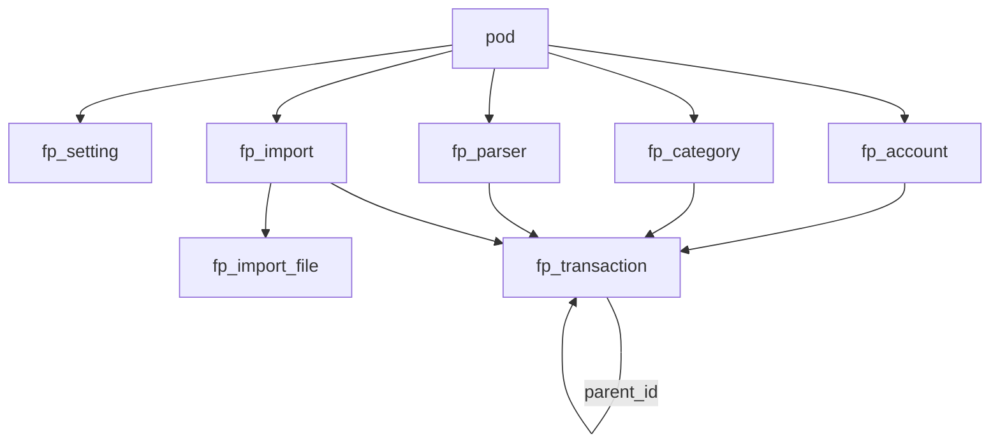

# Financial planning — implementation

Requirements: [`financial planning.md`](./financial%20planning.md). Do not re-litigate product decisions there.

**Out of this plan:** Open Banking, FX, split-across-categories, GoalJar jars, receipts, budget engine, bank parser presets, linked transfer pairs, Realtime, E2E, new npm packages (CSV parsing lives in `@so/model`).

**Follow existing SO patterns:** uuid PKs, `pod_id` + `on delete cascade` from `public.pod`, `moddatetime` on `updated_at`, table RLS + `app_private` helpers (not only UI checks), `{action}Db{Resource}` in `packages/web/lib/api/db/`, named exports from `@so/model`, no app barrels, Chakra v3, no `null` in TS we control (`undefined` at the boundary).

---

## Context

[`FeatureKind`](packages/model/src/space/featureKind.ts) is `todo_list` | `shopping_list`. [`create_pod`](supabase/migrations/20260829114000_todo_list_pod_description.sql) and `pod_feature_check` reject anything else. [`PodWorkspace`](packages/web/components/app/PodWorkspace.tsx) only mounts `TodoListBoard` for todo; other kinds show “coming soon”.

Financial data is **per pod**. Space owner is treated like **pod owner** for permission checks (same as todo `can_read_todo_pod` / column manage).

No Storage bucket for CSVs in v1 (parse in the browser; persist parsed rows + file **name** + **sha256** only).

---

## Slices (ship in order)

| Slice | User-visible | Depends on |
| --- | --- | --- |
| A | Create `financial_planning` pod; empty workspace + settings (currency, permission matrix) | catalog + `fp_setting` |
| B | Accounts, categories, manual transactions, Report / List, filters | A + ledger tables |
| C | Parser builder + import + hash warning + report + undo + auto-assign | B |
| D | Bill split, archive page, delete-all, category budget %, favourite | B (C optional) |

Do not start C until duplicate-key + parse helpers have tests.

---

## 1. Catalog

- Add `FeatureKind.FINANCIAL_PLANNING = 'financial_planning'`.
- [`parseFeatureKind.test.ts`](packages/model/src/space/parseFeatureKind.test.ts), [`featureKindLabel.ts`](packages/web/lib/pod/featureKindLabel.ts) (exhaustive `if` / switch — no silent “Shopping list” fallback).
- Migration: drop/replace `pod_feature_check`; `create_pod` `p_feature not in (...)` includes `financial_planning`.
- [`SpaceCreatePodDialog`](packages/web/components/app/SpaceCreatePodDialog.tsx) already maps `Object.values(FeatureKind)`.

---

## 2. Permission model

Roles already exist: `pod_user`, `pod_admin`, `pod_owner` ([`PodRole`](packages/model/src/space/podRole.ts)). Space owner uses the **pod_owner** column of the matrix.

**Resources:** `account` | `category` | `transaction` | `parser` | `import` | `bill_split` | `settings` | `delete_all`

**Actions:** `create` | `read` | `update` | `delete`  
(`import.create` = run import; `import.delete` = undo; `delete_all.create` = run delete-all; `settings.update` = currency + matrix.)

**Default matrix** (in `@so/model` **and** duplicated in SQL `app_private.fp_default_permission()` so RLS works with no row yet):

| Resource | `pod_user` | `pod_admin` | `pod_owner` |
| --- | --- | --- | --- |
| account | read, create, update | + delete | all |
| category | read, create, update | + delete | all |
| transaction | read, create, update (incl. archive, confirm, bulk assign) | + delete | all |
| parser | read | + create, update, delete | all |
| import | read | + create, delete (undo) | all |
| bill_split | create, update (if can update transaction) | same | all |
| settings | read (currency display) | read | + update |
| delete_all | none | none | create |

Owner can edit the stored matrix in pod settings. Changing the matrix requires `settings.update`.

**Enforcement:** `app_private.fp_can(p_pod_id, p_resource, p_action)` reads `fp_setting.permission` (or defaults), maps `auth.uid()` → pod role (or space owner → owner). Every `fp_*` RLS policy uses this (plus `can_read` for SELECT). Mirror the same helper in TypeScript (`fpCan`) for hiding buttons — **RLS is source of truth**.

---

## 3. Data model

One row `fp_setting` per pod (`pod_id` PK). Created when the workspace first loads or via trigger on `pod` insert when `feature = 'financial_planning'` (prefer **trigger on insert** so settings exist before UI).

### `fp_setting`

| Column | Notes |
| --- | --- |
| `pod_id` | PK, FK pod cascade |
| `currency` | text, default `'GBP'`, ISO-like code |
| `permission` | jsonb not null, default from `fp_default_permission()` |
| `created_at` / `updated_at` | moddatetime |

### `fp_account`

`pod_id`, `name` (unique per pod, trim), `kind` check (`current`, `savings`, `credit_card`, `cash`, `other`), `opening_fund numeric not null default 0`, `archived boolean not null default false`, `notes` optional, timestamps.

**Balance** is not stored: `opening_fund + sum(amount)` of transactions where `archived = false` and `parent_id is null`.

### `fp_category`

`pod_id`, `name` unique per pod, `direction` check (`transfer`, `income`, `expense`, `saving`), `budget_amount numeric` optional, `budget_period` check (`monthly`, `yearly`) optional, **check:** both budget columns null or both set, `favourite boolean not null default false`, `sort_order int not null default 0`, `colour` optional, `filters jsonb not null default '[]'`, timestamps.

Filter object: `{ "descriptionContains"?: string, "recipientContains"?: string, "amount"?: number }`. Match is OR across filters; within a filter, all provided fields AND. Amount equality within `0.01`.

On category delete: `fp_transaction.category_id` **on delete set null**.

### `fp_parser`

`pod_id`, `name`, `identifier` optional text (match **exact** first line of file after trim; no unique constraint — UI disambiguates), `has_header boolean not null default true`, `skip_rows int not null default 0`, `delimiter` default `,`, `column_map jsonb not null` (see §5), timestamps.

**No `account_id`.**

### `fp_import` / `fp_import_file`

Batch: `pod_id`, `parser_id` (on delete set null), `account_id` (restrict if account still exists; on account delete block if imports exist **or** set null — **restrict**), `created_by`, `created_at`, `undone_at` timestamptz optional.

File: `import_id`, `file_name`, `content_sha256` text not null, counts (`parsed`, `created`, `duplicate_skipped`, `failed`), `errors jsonb` (row index + message), timestamps.

Index `(pod_id, content_sha256)` on files via import join, or store `pod_id` on file too for lookup. **Not unique** (re-import allowed after dialog).

### `fp_transaction`

| Column | Notes |
| --- | --- |
| `pod_id`, `account_id` | account must belong to same pod (trigger) |
| `posted_date` | `date` not timestamptz (calendar date, no TZ shift) |
| `posted_time` | `time` optional |
| `amount` | `numeric` not null; **positive income, negative expense** |
| `description`, `recipient`, `notes` | text, default `''` |
| `external_id` | optional |
| `category_id` | optional |
| `confirmed` | `boolean not null default true`. Auto-assign sets `false`. Manual/bulk assign sets `true`. Uncategorised: keep `true` (flag unused) |
| `parser_id` | set null if parser deleted |
| `import_id` | set null if import row kept after undo? **Undo deletes txs**; keep import row with `undone_at` |
| `archived` | `boolean not null default false` |
| `parent_id` | optional FK `fp_transaction (id)` **on delete restrict**. Children: `parent_id` set. Same account as parent (trigger) |
| `split_portion_count` / `split_recurrence` | optional on **parent** only (`monthly` v1; store text check) so the UI can re-edit |

Indexes: `(pod_id, posted_date)`, `(account_id, posted_date)`, `(account_id, external_id)` where `external_id is not null` (non-unique), `(parent_id)`, `(import_id)`, `(archived)`.

**No unique** on duplicate signature (same-file repeats).

---

## 4. Domain rules (implement in `@so/model`, call from API/UI)

### Duplicate key (same account, non-archived only)

1. If `external_id` present: match `account_id + external_id`.
2. Else: `account_id + posted_date + amount + description + recipient + posted_time` (time only if **both** have time).

Within one import payload: do **not** collapse identical rows. Against DB: skip matches.

Same payload imported to another account: insert (user issue).

### Auto-assign

After insert of uncategorised rows: for each category with filters, collect matches. If **exactly one** category matches, set `category_id`, `confirmed = false`. If **zero or two+**, leave uncategorised (optional `matchedCategoryIds` only in preview, not stored).

Never overwrite `confirmed = true` with a category. Re-run: uncategorised only (and optionally `confirmed = false`).

### Report vs balance vs list

- **Account balance:** non-archived, `parent_id is null` (parent counts once; children never).
- **Category report / income / expense / saving totals:** non-archived, in date range, **exclude parents that have children**; **include children** whose `posted_date` is in range. Transfer direction **omitted** from income/expense (and from spend bars). Uncategorised = `category_id is null` among rows that count toward the report.
- **Default list:** non-archived, date + account filter. Show parents on their posted date (badge: split parent) **and** in-range children. Do not add parent amount into category totals.
- **Archived page:** `archived = true` only.

### Bill split

Input: parent id, `portionCount` ≥ 2, `recurrence` (`monthly` v1), optional start date (default parent `posted_date`). Create N children: dates `start + i * period`, amounts equal shares, **remainder on last child** so sum equals `abs(parent.amount)` with the **same sign** as parent. Same account, copy category, `confirmed = true`. Block if parent already has children until user replaces (delete children then recreate). Block manual **delete parent** while children exist; **undo import** deletes children then imported parents in one RPC.

### Sign / CSV

`column_map` keys = transaction fields: `date`, `time`, `amount`, `description`, `recipient`, `externalId`, `notes`.

Amount `sign`: `as_is` | `invert` | `all_negative` | `all_positive`. Optional later: `debit_credit` with two columns.

Date format string parsed with **dayjs** (already in web; model tests can use dayjs or a narrow parser). Output `posted_date` as `YYYY-MM-DD`.

Identifier: if parser.identifier set, first line of file (raw) trimmed must equal it to auto-select; user can still pick another parser.

File hash: **SHA-256** hex of raw bytes (`crypto.subtle` in browser).

---

## 5. SQL / RLS

- Enable RLS on all `fp_*`. `GRANT` authenticated; revoke anon.
- SELECT: `fp_can(..., 'account'|'transaction'|..., 'read')` — use **one** `fp_can(..., 'transaction', 'read')` for all money tables if we treat “can see the board” as transaction read. Simpler: **read** of every `fp_*` row in the pod if `fp_can(pod, 'transaction', 'read')` OR any resource read. **Decision:** pod member/space owner who has **any** read on `transaction` can SELECT all fp tables in that pod (avoid leaking parsers while hiding txs). If `transaction.read` is false, no SELECT.
- INSERT/UPDATE/DELETE: resource-specific `fp_can`.
- Triggers: account/category/parser/tx `pod_id` matches; tx.account.pod_id = tx.pod_id; child.account_id = parent.account_id; `parent_id` cannot point at a child (no nested splits v1).
- `create_pod` / pod insert trigger: if feature is financial_planning, insert `fp_setting`.
- Import + undo + delete-all: **`security definer` RPCs** in `public` that check `fp_can` then write (atomic). Table RLS still applies to normal CRUD.
- `undo_fp_import(p_import_id)`: if not undone: delete children of batch txs, delete txs with that `import_id`, set `undone_at`. Confirm copy in UI if recategorised/split.
- `delete_all_fp_transactions(p_pod_id)`: delete all txs (children first or cascade from restrict — **delete children then parents**).

Refresh [`packages/web/lib/supabase/database.ts`](packages/web/lib/supabase/database.ts) after migrate.

Local: `supabase db reset`. Production: GitHub Actions `db push` only (see root `AGENTS.md`).

---

## 6. `@so/model`

New folder `packages/model/src/fp/` (or `financialPlanning/`), export from [`packages/model/src/index.ts`](packages/model/src/index.ts).

**Tests required** for every exported function: CSV parse (quoted commas, skip rows, no header), sign transforms, identifier match, duplicate key, same-file repeats vs DB skip, auto-assign one/many/zero matches, split remainder, report row inclusion (parent with children), `fpCan` + defaults, date-range include child.

Keep files small; one function per file where reasonable.

---

## 7. Web API (`lib/api/db/`)

Examples (one export per file):

- `listDbFpAccounts`, `createDbFpAccount`, `updateDbFpAccount`, `deleteDbFpAccount`
- same pattern for category, parser, transaction
- `listDbFpTransactions` (date from/to, account id, archived flag)
- `bulkUpdateDbFpTransactionCategory` (sets `confirmed true`)
- `confirmDbFpTransactions`
- `archiveDbFpTransaction` / `unarchive`
- `createDbFpBillSplit`, `deleteDbFpBillSplit` (children only)
- `getDbFpSetting`, `updateDbFpSetting`
- `createDbFpImport` (RPC), `listDbFpImports`, `undoDbFpImport`
- `deleteAllDbFpTransactions`
- `sumDbFpAccountBalance` or derive in UI from listed txs + opening_fund (prefer **server sum** of non-archived parents to avoid loading all txs)

No `index.ts` barrel in `lib/api`.

---

## 8. UI

Mount from [`PodWorkspace.tsx`](packages/web/components/app/PodWorkspace.tsx) when `pod.feature === FeatureKind.FINANCIAL_PLANNING`.

Suggested tree: `packages/web/components/fp/` (ParentChild names, `export default function`).

**Board tab:** account strip (name + derived balance) → date presets + custom range + account filter → **Report | Transactions** (Chakra tabs, same idea as TJ session detail).

**Report:** totals (income, expense, saving; transfer excluded); category bars + uncategorised; budget % when `budget_amount` set (monthly vs selected month; yearly vs selected year / YTD — document in UI copy).

**Transactions:** sort, search, multi-select, category assign, confirm unconfirmed, archive, split on parent.

**Archived:** separate tab or subview on the board (“Archived”), not mixed into report totals.

**Parser:** dedicated panel/dialog — drop example file → propose identifier checkbox → column chips DnD onto fields → transform checkboxes → live first data row vs parsed transaction.

**Import:** drop **multiple** files → auto-select parser from first file’s first line (if multiple parsers match, picker) → choose account → import. If sha256 already on a non-undone import file in this pod → dialog. Then show stored report; undo button.

**Settings tab:** extend [`PodWorkspaceSettingsTab`](packages/web/components/app/PodWorkspaceSettingsTab.tsx) or an `FpSettings` block: currency, permission matrix (grid role × resource × actions), delete-all.

Hide/disable controls with `fpCan` using pod role + space owner + setting.permission.

PWA/phone: import and categorise must work; parser builder may be stacked (columns list + targets) if DnD is awkward — still no desktop-only dead end.

---

## 9. Manual after production `db push`

- Confirm `financial_planning` pods can be created (constraint + `create_pod`).
- No new Storage bucket.
- No Realtime.

---

## Risks

- **Permission JSON in RLS:** keep `fp_can` simple and tested via SQL comments + app tests; invalid JSON falls back to defaults.
- **Large CSVs:** parse on client; cap rows in v1 (e.g. 10k) with a clear error; import RPC batched if needed.
- **Double-count:** never sum children into account balance; never sum split parents into category report.
- **`create_pod` signature** already has description; only extend the feature allow-list.
